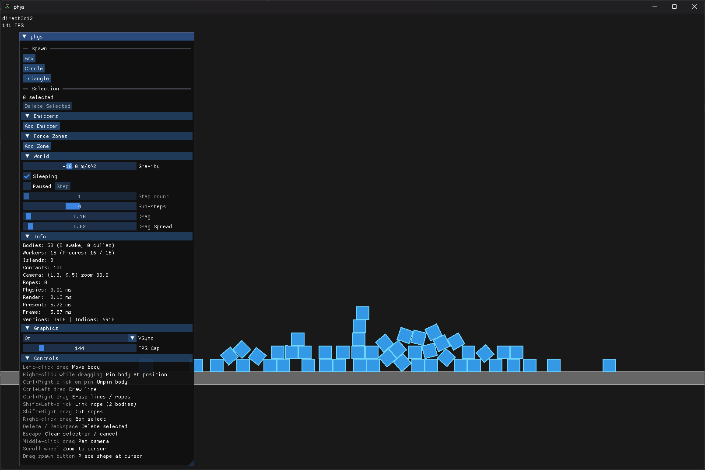

<p align="center">
  
</p>

# phys
A 2D physics sandbox written in C++23. Spawn rigid bodies, draw collision geometry, link bodies with ropes, pin them in place, and apply force fields - all in real time.

Built with [Box2D](https://github.com/erincatto/box2d), [SDL3](https://github.com/libsdl-org/SDL), and [Dear ImGui](https://github.com/ocornut/imgui). Runs on Windows 10+, Linux (Flatpak), and macOS.



Pre-built binaries are available on the [releases](https://github.com/angelfor3v3r/physics-thing/releases) page. x86-64 builds come in AVX2 and non-AVX2 variants - AVX2 is faster but requires a CPU from ~2013 or later (Intel Haswell / AMD Excavator). Use non-AVX2 if unsure. macOS builds target ARM64.

## Build
Requires CMake 3.28+ and a C++23 compiler (GCC, Clang, or MSVC). Dependencies are fetched automatically via [CPM](https://github.com/cpm-cmake/CPM.cmake).

```bash
cmake -B build -G Ninja -DCMAKE_BUILD_TYPE=Release
cmake --build build
```

## Libraries
| Library | License |
|---------|---------|
| [SDL3](https://github.com/libsdl-org/SDL) | [Zlib](https://github.com/libsdl-org/SDL/blob/main/LICENSE.txt) |
| [Dear ImGui](https://github.com/ocornut/imgui) | [MIT](https://github.com/ocornut/imgui/blob/master/LICENSE.txt) |
| [Box2D](https://github.com/erincatto/box2d) | [MIT](https://github.com/erincatto/box2d/blob/main/LICENSE) |
| [FreeType](https://freetype.org/) | [FTL](https://freetype.org/license.html) |
| [dp::thread-pool](https://github.com/DeveloperPaul123/thread-pool) | [MIT](https://github.com/DeveloperPaul123/thread-pool/blob/master/LICENSE) |
| [scope_guard](https://github.com/ricab/scope_guard) | [Unlicense](https://github.com/ricab/scope_guard/blob/main/LICENSE) |

## License

[MIT](LICENSE.md)
